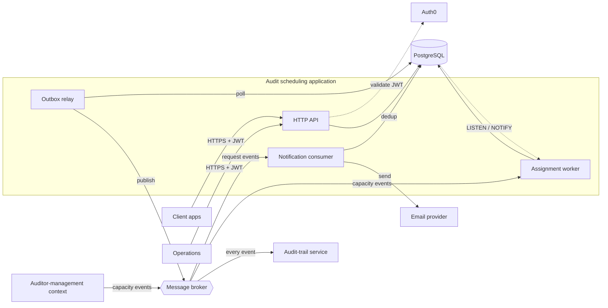

# System context

A one-glance view of how the pieces fit. Nodes are names only; the function of each element and
what each edge carries are in the legend below, so the picture stays readable.

## What each element does

| Element | Function |
|---|---|
| **Client apps** | Raise audit requests, poll status, download reports. |
| **Operations** | Upload the finished report through the internal API; the ops-only cancellation path. |
| **Auth0** | Issues and validates the JWT. The application is a resource server — it never holds credentials. |
| **Auditor-management context** | Out of scope here. Emits the capacity events (`AuditorOnboarded`, `AuditorAvailabilityOpened`) this system consumes. |
| **HTTP API** | Client and internal endpoints. Validates, maps errors to `problem+json`, projects a request across `audit_request` and `audit`. |
| **Assignment worker** | Single writer. Drains the `PENDING` queue, picks the least-loaded auditor and earliest date, attaches to an existing audit or schedules a new one. |
| **Outbox relay** | The only reader of `outbox_event`. Publishes every row to the broker, then marks it published. |
| **Notification consumer** | Broker subscriber. One email per request event, deduplicated by event id in `notification_dispatch`. |
| **PostgreSQL** | `audit_request` + `audit` (written), `supplier` / `site` catalogue (insert-only), `client` / `auditor` (read-only), `outbox_event`, `notification_dispatch`. |
| **Message broker** | Fan-out transport. At-least-once delivery; never a durability guarantee. |
| **Audit-trail service** | External — its own database, retention and access control. The immutable record, not deletable by this system (ADR 0002). |
| **Email provider** | The `NotificationSender` channel. Templating and delivery are out of scope. |

## What each edge carries

| Edge | Carries |
|---|---|
| Client / Operations → HTTP API | HTTPS with a bearer JWT. |
| HTTP API ⇢ Auth0 | JWT signature and claim validation. |
| HTTP API → PostgreSQL | A state change and its `outbox_event` row, in one transaction. |
| Assignment worker → PostgreSQL | Claims a `PENDING` row with `FOR UPDATE SKIP LOCKED`; writes the `audit` and outbox rows. |
| PostgreSQL ⇢ Assignment worker | `LISTEN/NOTIFY` — wakes the worker on a new request or a released slot. |
| Outbox relay → PostgreSQL | Polls for unpublished `outbox_event` rows. |
| Outbox relay → Message broker | Publishes every outbox row. |
| Message broker → Audit-trail service | Every event. |
| Message broker → Notification consumer | The `AuditRequest*` events. |
| Notification consumer → PostgreSQL | The `notification_dispatch` claim that makes the send idempotent. |
| Notification consumer → Email provider | The rendered email. |
| Auditor-management → broker → Assignment worker | Capacity events that trigger a targeted retry of pending requests. |
